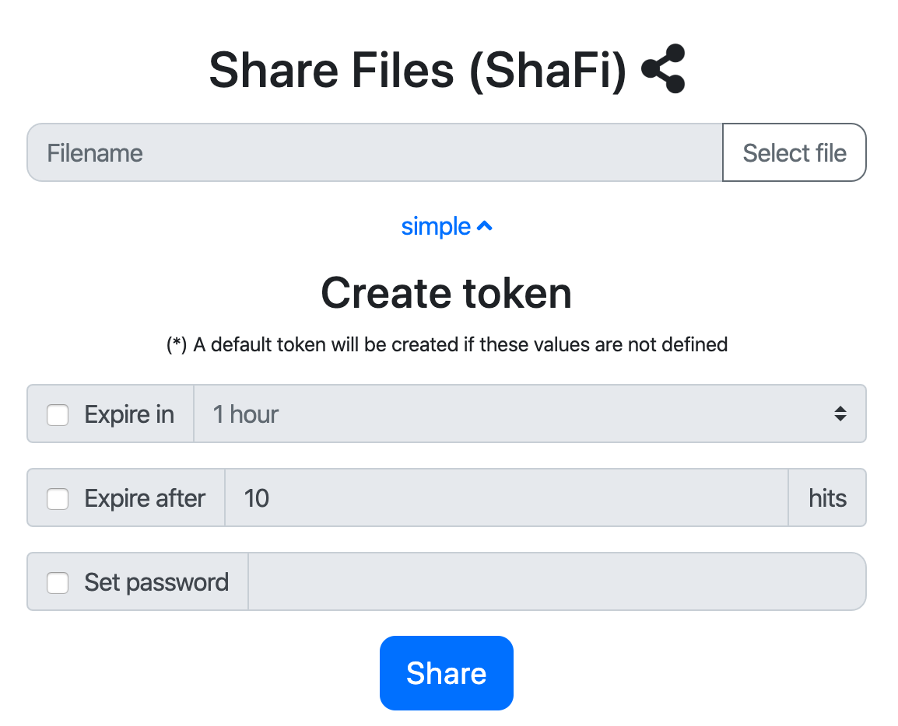

# ShaFi: Share your Files
ShaFi is a platform to share files using self expiring tokens. It offers features similar to WeTransfer, but hosted in your servers thus enabling you to control the limitations. It is similar to [youtransfer](https://github.com/YouTransfer/YouTransfer), but ShaFi implements a backend to allow registered users to have control over their files, to have stats of usage of the sharing links and to create multiple sharing tokens.

ShaFI implements two main workflows: 
- Unregistered sharing (similar to WeTransfer): an unregistered user uploads a file to ShaFi, and ShaFi creates an unique token that will automatically expire in 1 week.
- Registered sharing: the registered users can upload files, but they are allowed to manage tokens for these files. It is possible to create multiple tokens for the same file, with different features: expiration dates, expiration hits, using password, etc.



## Features

1. *Anonymous uploads* can be enabled or not (if disabled, only authenticated users can upload files, but downloads are public).
1. It is possible to create *multiple access tokens for the same file* (thus having differente expiration features such as date or hits).
1. It is possible to include a *password to protect a specific token*.
1. It is possible to define a *maximum size for the files*. And it can be different for anonymous users than for registered ones. Moreover it can be different for each group of registered users (e.g. users, admins, etc.).
1. It is possible to *stablish a quota* for the storage size of files. The quota can be defined per user or per group of users. The quota is not shared, and only the files consume quota (not each token).
1. *Uploading files is resumable*. That means that, if network connection is lost and the file was uploading, the user will need to upload only the part that has not already been uploaded.

## Installation

### Test using docker

You need a working docker installation

1. Get ShaFi and build the docker container

```
$ git clone https://github.com/dealfonso/shafi
$ cd shafi
$ docker build . -t shafidemo
```

2. Start a container with the generated image

```
$ docker run -id -p 10080:80 --name shafidemo shafidemo
```

3. Navigate to the URL of the new installation: `http://localhost:10080/shafi`

    - user: *shafi*
    - password: *123*

**WARNING:** This image should be used with caution, because the passwords are known. 

**WARNING 2:** The files, users and configuration changed in the container will be lost upon stopping the container.

### Install using apache

You need a working installation of Apache and PHP 7.2 or higher, and make sure that `mod_rewrite` is enabled.

1. Prepare a user for the database

```
$ mysql -u root -p
mysql> create database shafi;
mysql> create user shafi@'localhost' identified by 'a-secret-password';
mysql> grant all privileges on shafi.* to 'shafi'@'localhost';
mysql> flush privileges;
```

2. Get ShaFi and copy it to the apache root folder

```
$ git clone https://github.com/dealfonso/shafi
$ cp -r shafi /var/www/html
$ chown -R www-data:www-data /var/www/html/shafi
```

3. Prepare the configuration for ShaFi in file `/etc/apache2/conf-available/shafi.conf` (please adapt it to your installation):

```
<Directory /var/www/html/shafi>
   AllowOverride All
</Directory>
```

4. Enable the configuration and restart apache

```
$ a2enconf shafi
$ a2enmod rewrite
$ service apache2 restart
```

5. Use your browser and navigate to the installation URL and customize your installation:

```
http://localhost/shafi/install/install.php
```

In this guide we'll use the following settings:

- Database name: shafi
- Database user: shafi
- Password: a-secret-password
- Web server URL: http://localhost
- URL path for ShaFi: /shafi

Prepare the ShaFi configuration file `/var/www/html/shafi/config.php` and the htaccess file `/var/www/html/shafi/.htaccess` with the result of the configuration.

## Configuring ShaFi

The configuration of ShaFi, is controlled by a file `config.php` in the root folder of ShaFi. In that file you can include some variable definitions to configure the different options of ShaFi. You have an example file `config.php-sample` that contains the different options explained.

It is a good idea to configure ShaFi by using the `install.php` web page. It will ask you for the essential configuration and will enable to create the basic configuration file. Then you can follow this guide to fine-tune your installation.

Some of the configuration parameters are explained in the following paragraphs.

### Mandatory parameters

It is mandatory to define the parameters to connect ShaFi to the mysql database, using the next variables in `config.php`:

```php
// URL of the mysql server
$db_servername = "";
// Database to use for shafi
$db_database = "";
// Username with permissions to manipulate tables in the database
$db_username = "";
// Password for the user
$db_password = "";
```

Moreover, it is mandatory to set the URL of the server that will host ShaFi, along with the endpoint of the ShaFi application. These values are defined using the following constants:

```php
// Server name (with http:// or https:// prefix)
define('__SERVER_NAME', 'http://localhost');
// Root URL for ShaFi
define('__ROOT_URL', '/');
```

### Configuring the folder in which the files are stored

Files uploaded to ShaFi need a storage folder. It is possible to define the folder in which to store them using the next constant:

```php
define('__STORAGE_BASE_FOLDER', './uploads');
```

The folder may be an absolute path or a path relative to the ShaFi main folder.

**IMPORTANT:** The user that runs the web server needs writting permissions in that folder.

### Disabling anonymous uploads

The default configuration allows anonymous users to upload files to your ShaFi deployment. But if you do not want to open ShaFi to the world and you want to provide acccess only to your registered users, you can **disable anonymous** uploads. It can be disabled by including the next line in `config.php`:

```php
define('__ANONYMOUS_UPLOAD', false);
```

### Defining the maximum size for the uploaded files

The maximum size for the uploaded files is controlled by including the next content in `config.php`:

```php
define('__MAX_FILESIZE', array(
    '' => 1*1024*1024,
    'u' => 10*1024*1024,
    'a' => 100*1024*1024
));
```

Each entry in the `__MAX_FILESIZE` array corresponds to a group of users. `''` is for **any** user (e.g. anonymous), `'u'` is the size for **registers users** and `'a'` is for **admin users**.

### Defining the quota for the files of each group of users

The maximum storage space that a user can have in ShaFi is controlled by quotas. It is possible to define a quota for each group of users. The quota is controlled by the following array:

```php
define('__STORAGE_QUOTA_GROUP', array(
    'u' => 10*1024*1024,    // Quota for registered users
    'a' => 100*1024*1024    // Quota for admin users
));
```

**IMPORTANT:** The values defined here are _per user_ quota, not a shared quota. That means that _each user_ that belongs to a group will be able to use the whole storage space defined by the quota. In the example, each user in `'u'` group will be able to store 10 Mb.

Quota for anonymous users can be controlled using the following constant:

```php
define('__STORAGE_QUOTA_ANONYMOUS', 10 * 1024 * 1024);
````

**NOTE:** There is a single `anonymous` user, so that quota limits the amount of storage space that can be used by the sum of files of any anonymous user.

### Setting the token generation function

The default behaviour of ShaFi is to generate unique ids for the tokens according to [this specification](https://tools.ietf.org/html/rfc4122). e.g.: http://shafi.myserver.com/9de61b5d-024e-4a8c-8682-a9876ac30aee

These tokens are very long and _hard to spell_. It is possible to change the way that tokens are generated, by setting the function used to generate them.
ShaFi includes an additional function that you can use. It is called `get_random_string` and it will generate short tokens, similar to those generated by goo.gl or bit.ly (e.g. http://shafi.myserver.com/9IjKIN9U). In order to use it, include the following definition in the `config.php` file:

```php
define('__TOKEN_GENERATOR_FUNCTION', 'get_random_string');
```

### Default expiration settings for tokens

When an anoymous user uploads a file, ShaFi creates a token, and that token will expire after a period of time or a number of hits. The expiration settings are controlled using the following variable (time is expressed in seconds).

```php
// This example sets the expiration date to one week
define('__ANONYMOUS_UPLOAD_DEFAULT_SECONDS', 60*60*24*7); 
// It is a good idea to limit the amount of hits to avoid DoS
define('__ANONYMOUS_UPLOAD_DEFAULT_HITS', 1000);
```

For registered users, if they do not set expiration conditions, ShaFi will create a default token. The values for the expiration conditions are controlled with the next constants:

```php
define('__DEFAULT_EXPIRATION_SECONDS', 60*60*24*7);
define('__DEFAULT_EXPIRATION_HITS', null);
```

If any condition is disabled (i.e. set to null), the token will be considered to be infinite. If you do not want to allow infinite tokens in your ShaFi deployment, you can control it with the following constant:

```php
define('__ALLOW_INFINITE_TOKENS', false);
```

**IMPORTANT:**  If any of the settings is set to null, that condition will be disabled (e.g. limiting the time but not the hits).

## Use cases

### Creating a new group of users

In order to create your own groups, you can define a var `$__CUSTOM_GROUPS` in `config.php`. It is an array of groups, where the index is a single letter that represents the group.

The are a set of legacy groups in ShaFi (defined as next):

```php
define('__LEGACY_PERMISSIONS', [
    'l' => 'authorized',
    'o' => 'owner',
    'u' => 'user',
    'a' => 'admin'
])
```

As an example, if you wanted to define an additional group (e.g. "advanced users"), you could add the next code to `config.php`:

```php
$__CUSTOM_GROUPS = [
    'A' => 'advanced users`
]
```

Then you can use the keys of the groups to define other limits (e.g. quotas, maximum sizes, etc.).

### Modifying the web content

### Using an external authentication mechanism

## More on ShaFi

### Some technical features
- The upload of files is made of chunks, by using [Resumable.js](https://github.com/23/resumable.js). So the files are also resumable if they fail to upload.
- The tokens are unique, in the form of http://shafi.com/507564f4-70d2-46ce-ac51-7af9d25dade7
- Diffrent tokens for the same file may have different features (e.g. different expiration dates, different expiration hits, passwords or combinations of them).
- Files are expired but not automatically deleted (so that you can have a track of the files uploaded to your servers).
- Most options are configurable (e.g. default token expiration for both anonymous or registered, allowing passwords for users, grace period for files that are not being shared, etc.)
- It is translated into spanish and english (translations are welcomed).
- It is developed in PHP so it works in most of servers.
- ShaFi is easy to integrate with different authorization mechanisms (e.g. Google)
- ShaFi is designed to use different storage backends. At this time it only implements filesystem backend, but S3 is easy to implement.

### Future features
- Integrate with Google auth.
- Use Amazon S3 as a backend for storing files.
- Allowing multiple files to be uploaded (or downloaded) at once.
- Add quotas of files or storage space.
- Send e-mails when expiration dates are near.
- Hits stats (i.e. integrate with GeoIP and others).
